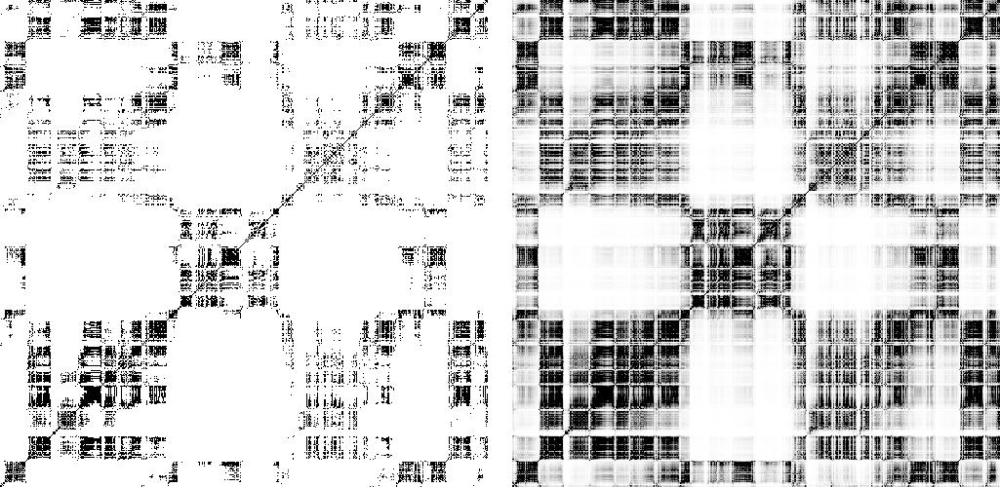

## What remains?
### Parameter tuning and small changes
#### Labeler
Studying the first results from the training process, there seems to be minor differences in how the network learns for
the different company datasets. The labeler might be partly to blame for this. While tuning the labeler, a very small 
range of companies was tested. This means that the threshold values, sliding median window, smoothing factor and maybe 
even the label criteria might need some rework. A good labeler should be dynamic and robust, but verifying this is a lengthy
process and was therefore not prioritized for the first test runs [^1].

#### Normalization
Optimization of the normalization process has not yet been done. This process involves testing multiple normalization routines
and studying their result. This will become especially important in the future as the next section presents. Another important
step is to tune the parameters for each feature that is normalized. As of today, these parameters are held constant over all
the features, but their variance differ by large margin, so perhaps a more thorough look at the normalization parameters
is beneficial.

#### Feature representations
The features present in the raw data where not treated much before normalization except for the fact that both the data
for *high* and *low* where recast into representing differences from the mean price during the period
(see: [Preprocessing: Normalization](https://haakonsvane.github.io/Icarus/preprocessing.html#normalization)). There are however
multiple ways of expressing stock price data. One way, which might even have proven useful for the normalization process
is to instead list the stock prices as percentage increases. This is in itself a normalization procedure, and whether or not 
this new representation would need another layer of normalization on top could be investigated further. 

## New Ideas
As of today, the neural network does no predictive classification in the sense that is neither tries to label very
recent data, or predict any future data. This was mainly done in order to guarantee some results because interpreting the
different results is an important aspect of building the network.

Now that this has been done, it is finally time to look at ways to perhaps do some sort of prediction on the data.

### 2D Convolutional Neural Network using recurrence plots
The networks that have been constructed have all been 1D neural networks in the sense that they all rely on time series data
where each feature is an exclusive and explicit function of time. Since the data is multivariate in the sense that each datapoint
contains many features, there are ways to transform this data into the two dimensional space. One promising way to do this is to use
recurrence plots. [Research](https://www.researchgate.net/publication/324868918_Recurrence_quantification_analysis_of_business_cycles) 
suggests that this way of representing fincancial data could be promising.

#### Clustering
In order to convert the time-series data to images of the equal resolution, successive data points with the same label
are clustered together. Trimming all the clusters of size greater than *CLUSTER_SIZE* down to this value around their
midpoint and discarding the rest, leaves clusters of equal size with the same label for all data points within.

#### Recurrence plots
For the 2D convolutional neural network, [recurrence plots](https://en.wikipedia.org/wiki/Recurrence_plot) where created
from the equally partitioned clusters of data. The idea is to have the network find patterns in the different regions
which can be generalized during training. Visually inspecting the recurrence plots generated in this process seem to
indicate that the data resembles the characteristics of brownian motion. This is expected, but not appreciated.

There are two datasets created from the recurrence plots:
1. **Hard recurrence**: This is the normal recurrence plot. Phase space distances below the nth percentile are shown as
black pixels in the images. The rest are white.
2. **Soft recurrence**: This is a proposed modification to the normal recurrence plots. Phase space distances below the nth percentile are shown as
black pixels, while values over the nth percentile are exponentially mapped to values in the range \[0, 1\] where 0 is a white pixel and 1
is a black pixel. This incorporates more information into the recurrence plot, but the significance of it has yet to be tested. The
exponential factor of scaling $\alpha$ is referred to as $\texttt{REC_ALPHA}$.

Below are examples of how these plots differ. The dataset used is 125 hours (500 datapoints) of AAPL stock, year 2018:

Images of (left:) Soft recurrence plots and (right:) hard recurrence plots.

Since the recurrence plots use a distance metric to define points that are in close proximity in phase space, the normalization
procedure that is applied to the data becomes important. For example, the feature *volume* has a large variance. This
would cause a distance between two data points with a high differnce in volume to not be considered close, even though the
volume data between the two points are as close as they can get in the dataset. Properly normalizing the data to a common
codomain is therefore important, but how transformation is done is perhaps even more important. Sadly, there is no way of
telling which normalization procedure is better before the network starts producing any results, so this could be considered
furhter *further* work.

[^1]: I should clarify what is meant by "first test runs". These runs refer to the series of runs we performed before
    finalizing the university project. The project itself is by no means finished yet (I hope).