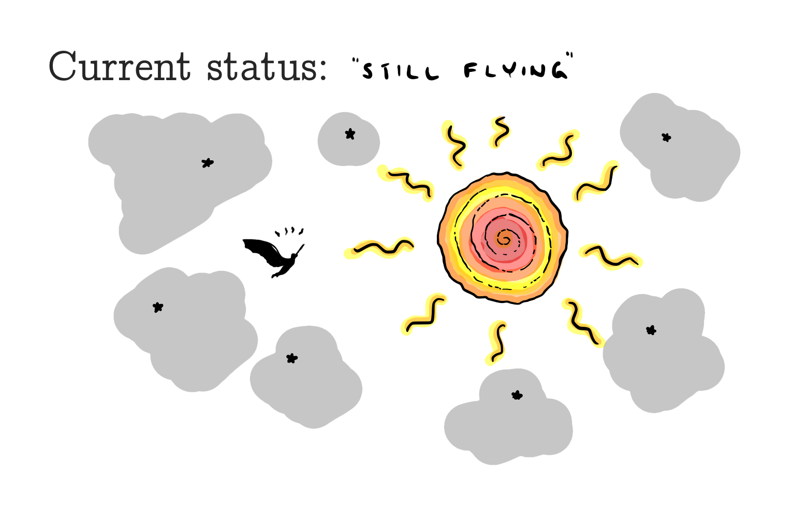

### What is it?
As of this day, Icarus is a a neural network project tasked to classify *buying*, *holding* and *selling* 
points/regions in stock price data. The network utilizes high-frequency stock data that has been labeled with a custom
stock labeler. The full source code is found at the project [github](https://github.com/HaakonSvane/Icarus).

### What does this site provide?
This site is meant as a more thorough walk-through of what happens behind the scenes using less formal language than what
is presented in the project report. 
