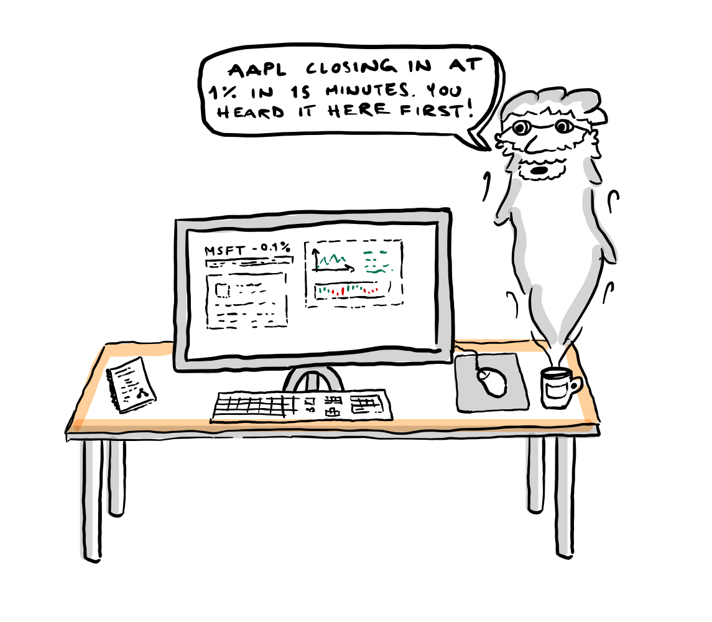
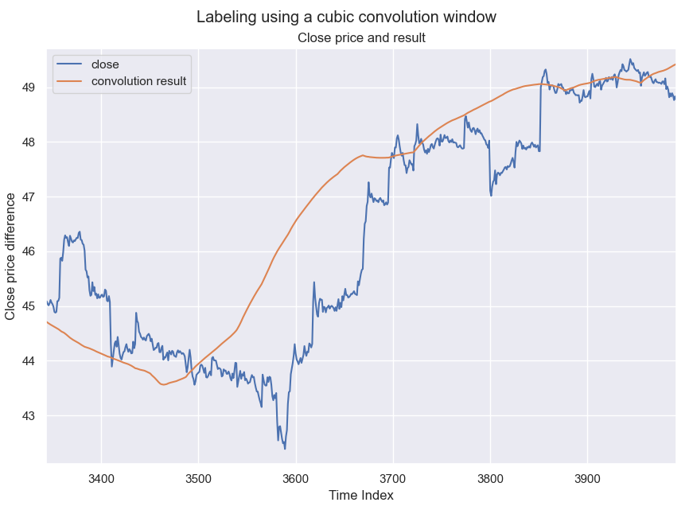
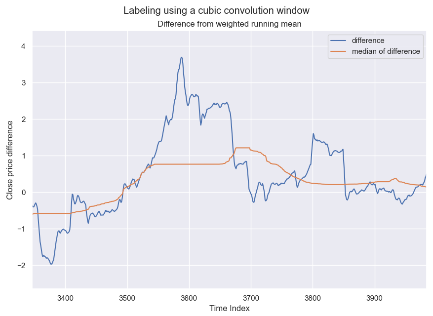
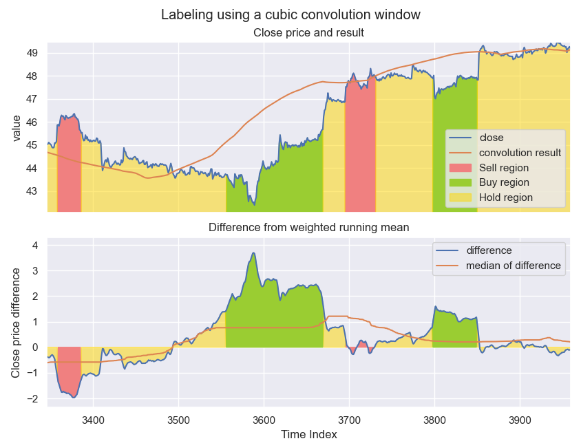

## How do we label the data?
What determines a buying point, and when is a good time to sell any shares that one is in possession of? 
Looking at a chart of stock prices, perhaps the following rule will suffice:

>For a price $P(t)$, a range $ t_i \in[t_{i,1}, t_{i,2}]$ is considered a buying region if for some time interval
>$t_f \in [t_{f,1}, t_{f,2}]$ where $t_{f,1} > t_{i,2}$, the prices $P(t_f) > \alpha P(t_i)$ for all $t_i, t_f$ and vice versa for a
>selling region. The constant $\alpha$ determines the $\textit{threshold}$ value for buying/selling. 

Any prices that are not a buying point or a selling point will therefore be labeled a holding point.

### Why not just buy or sell all the time?
In theory, a stock price could remain flat for its entire lifespan. In practice however, it often fluctuates in a
(pseudo)random[^1] fashion. Why do we need *hold* regions then?

This might seem like a stupid question to begin with, but when trying to define what a buying and selling point is,
this question requires attention. From a pragmatic perspective, the determination of a hold point is perhaps trivial:
>If for some buying region $\mathbf{B}$, a sale of any potential holdings in a following temporal region $\mathbf{H}$ does 
>not yield any financial gains or losses, the region $\mathbf{H}$ is a holding region.

The only issue with this definition is that it very seldom happens that the net gain after a sale is **exactly** zero.
If there are *any* financial gains associated with selling from a certain position, surely we should sell here?

Let us try another perspective. Let's imagine that you just bought some amount of stocks at a time $t_i$. If a time travelling 
genie where to magically appear and tell you that the stock price in 15 minutes would be 1 point higher than it currently is, 
would you sell your position in 15 minutes? There are a lot of reasons to defend any decision you might choose to take.
Lets take a look at some of the alternatives

Lets say you decide to sell because you know for a fact that you will make money of the situation. 
In this scenario, you have weighted the risk, which is potentially missing out on a bigger fish just down the road,
and reward, which is the guarantee of some monetary gain. Either way, you have decided to set a threshold value for when
to buy and when to sell.

If you decide to hold your position because you believe that at some time $t_f$, the price of a stock will yield even
greater gains than selling 15 minutes into the future, you would still have to set some threshold value
for when you would actually sell. Surely, waiting for an infinite amount of time is not a good idea, but somewhere in
between might be.

For both scenarios, a threshold value must be set. This value determines when a region of time is a good time to sell and 
when a region of time is a good time to buy. There is no guarantee that any region that is not a buying region must be a selling
region, so this is therefore named a holding region. This region is works as an uncertainty period: A period where an
investor is not comfortable making any decisions on whether to buy or sell. The threshold values can therefore be seen as
*gut feel*-parameter (curtesy of my girlfriend).

## The labeling stages 
Since the determination of the labels for a price point $P(t)$ requires an insight into future values
$P(t+n*\Delta t), n \in \mathbf{Z}^+$ where $\Delta t$ is the temporal resolution, the main idea behind the new labeling 
algorithm is to use convolutions with a weighted window to determine how a closing price $P(t)$ compares to future 
prices. The labeling process can be boiled down to three stages:

### First stage
This is the convolutional stage. Here, some weighted window is slid over the closing price data. If the window is biased
towards future price values, the result of the convolution
Multiple convolution windows was tried, but a cubic weighted window gave the best results. 
The results of applying this window is shown in the figure below. 
For a convolution window of size $\texttt{WIN\_SIZE}$, the $\textit{look ahead}$ period for the labeler is
$\texttt{WIN\_SIZE}/2$. 

First stage of the labeling process on AAPL stock over ~26 trading days.

### Second stage
The second stage is the differencing and median stage. Here, the difference between the actual close price and the results
from stage 1 is computed and a sliding median window with size $\texttt{MED_WIN}$ is applied across the difference. The reason
for choosing a median window instead of a normal simple window is that we don't want sudden spikes to influence the averaging
too much. The results of applying this stage of calculations is shown in the figure below.

Second stage of the labeling process on AAPL stock over ~26 trading days.

### Third stage
The final stage of the labeling process is to compare the results from the sliding median to the initial closing price.
The fraction $\texttt{med_res}_i / \texttt{close}_i = \alpha$ is compared to the threshold values $\texttt{THRESH_BUY}$
and $\texttt{THRESH_SELL}$ to determine what label to give the instance. 
Due to fluctuations in the stock price over small time-scales, a smoothing factor is also applied to the closing price.
This is a small simple average (flat convolution window of small size). By introducing this smoothing factor to the data before
determining $\alpha$, the labeling regions are more coherent which will be useful later in the project.
The final results of the labeler is shown in the figure below.

Third stage of the labeling process on AAPL stock over ~26 trading days.

[^1]: Whether or not this is a truly random process will not be discussed here, but it should be noted that the
    author is strongly opinionated when it comes to the subject of "absolute randomness". You may therefore choose to either
    remove the parenthesis, or remove its content depending on your own personal belief.