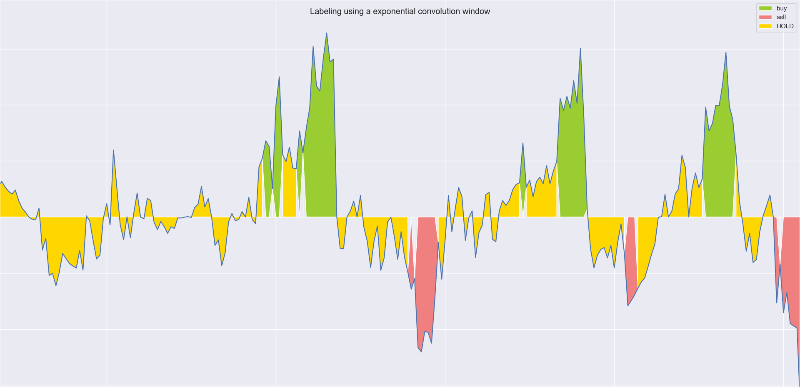

# Index Labeler

 

### What is it?

This package is responsible for labeling provided stock market data with the three labels __buy__, __sell__ and __hold__. 
The script uses multiple 1D convolutions and threshold values to determine the different labels given data
of closing prices for stock indices. 